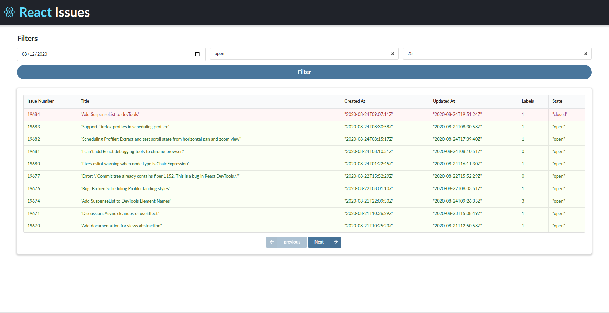

# Listar issues do projecto React 

## objetivo deste projeto

fazer uma UI para exibir os status dos problemas do projeto React no GitHub, consumindo a api do [github](https://api.github.com/repos/facebook/react/issues).

## UI criada para desafio

## dependências

## dependências de desenvolvimento

 * eslint: Para definir um guia de estilo para código e ele ter uma boa legibilidade, escolhi o style guide standard para o projeto pois acho que o código fica mais limpo.

## cola

https://docs.github.com/en/rest/reference/issues#list-repository-issues
https://api.github.com/repos/facebook/react/issues?per_page=2 - ver como saber quantas páginas para navegar

## o que identifiquei que falta fazer

* [x] adicionar redux
* [x] adicionar tabela do semantic ui
* [x] fazer uma ui bonitinha
* [x] exibir dados na tabela 
  + [x] Issue Number 
  + [x] Title
  + [x] Created At
  + [x] Updated At
  + [x] Labels
  + [x] State
* [x] fazer requisição para o endpoint
* [ ] adicionar paginação
* [ ] adicionar funcionalide dos filtros
* [ ] escrever Readme
  + [ ] explicar porque das minhas escolhas
